# Compilation Test
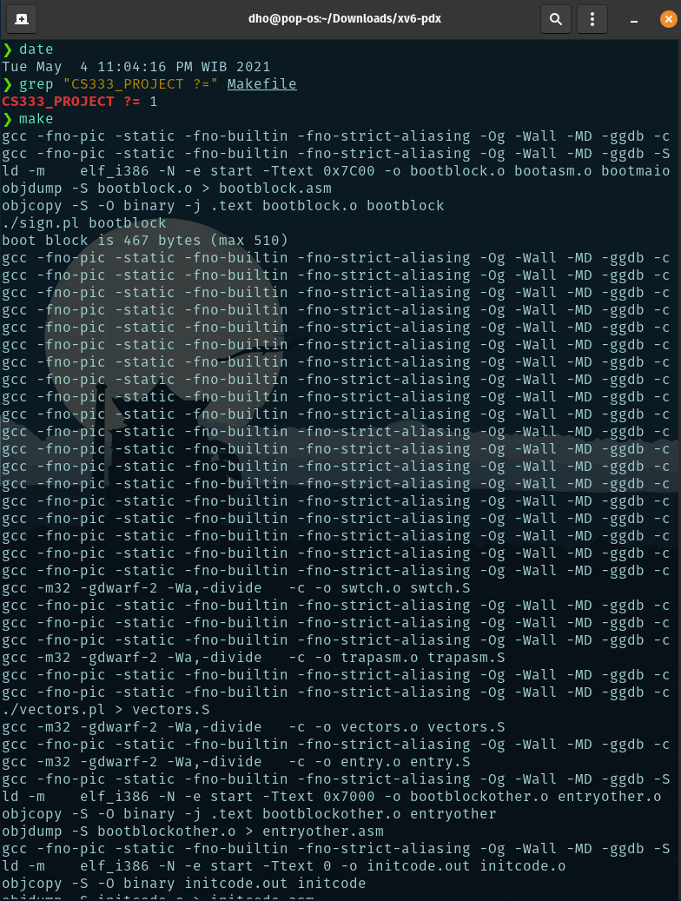
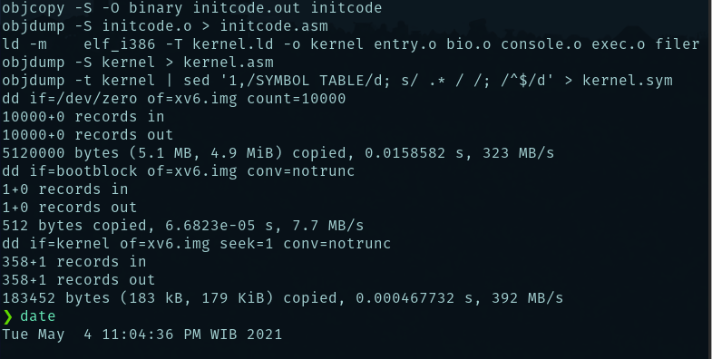
### Makefile
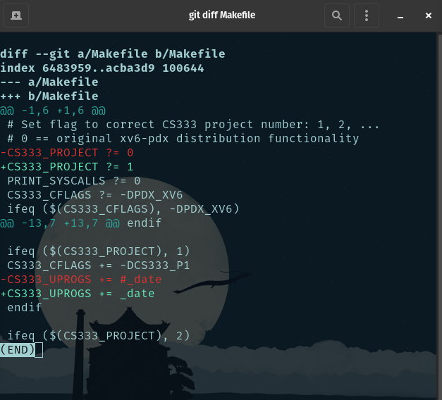

# System Call Tracing
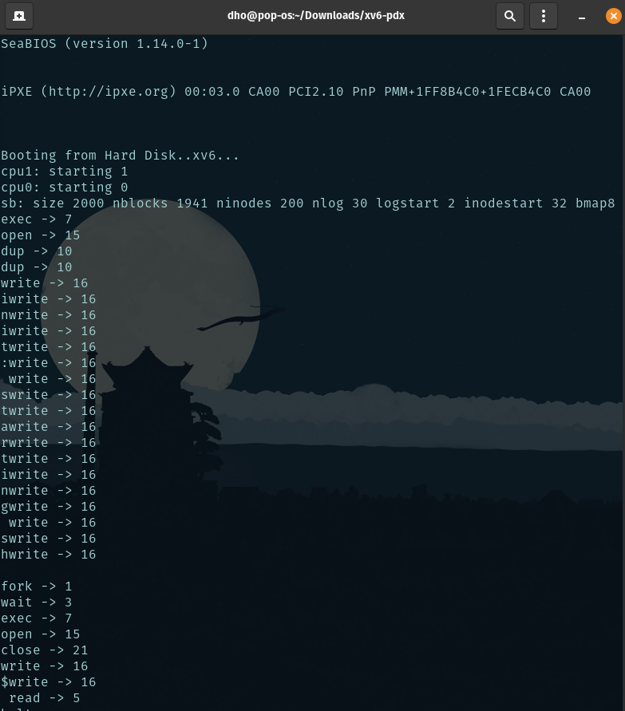
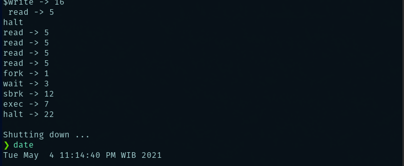

### Makefile
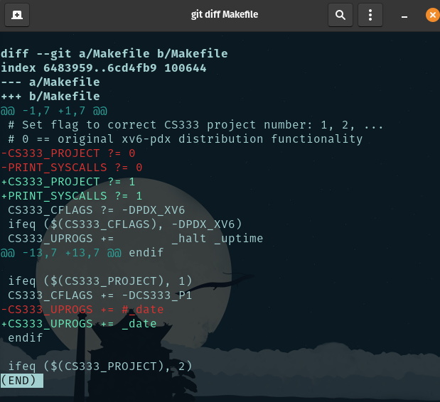

# Conditional Compilation
## CS333_PROJECT set 0
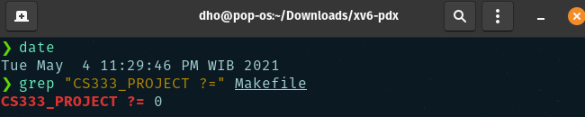
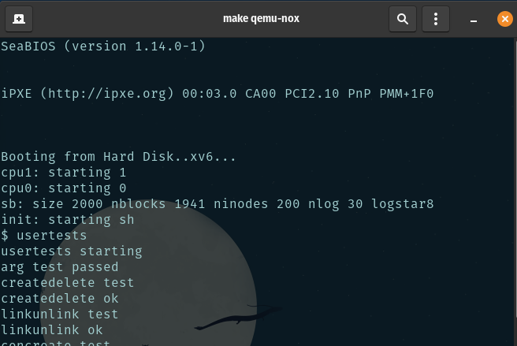
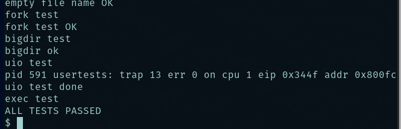

## CS333_PROJECT set 1
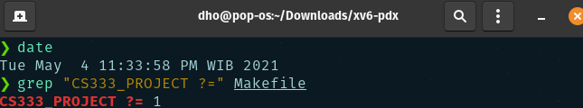
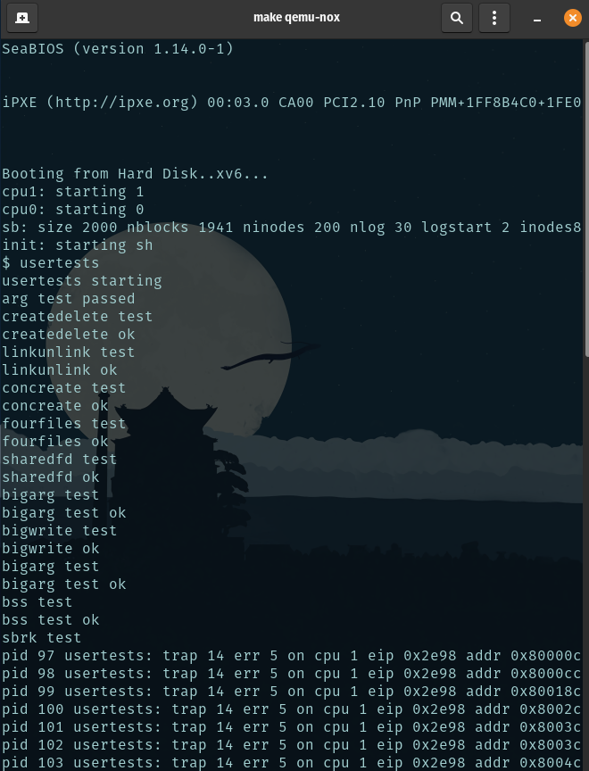
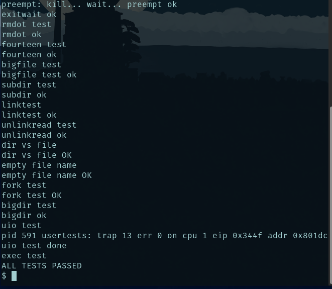

# Date
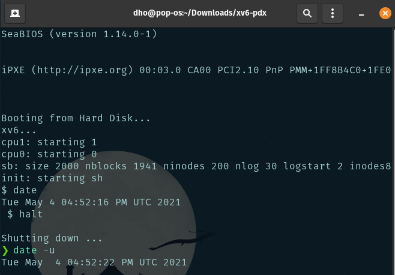

# CTRL-P
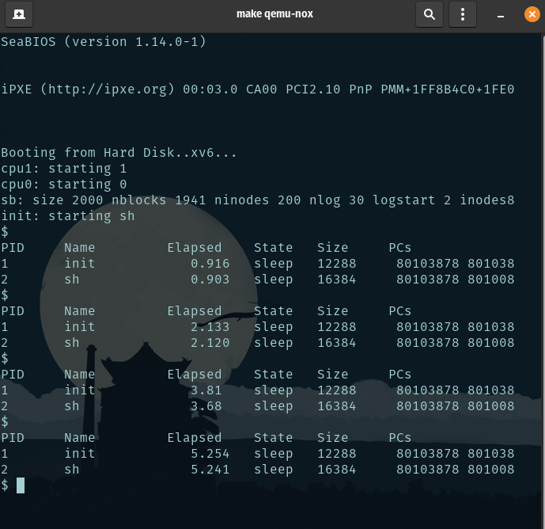

### date.c
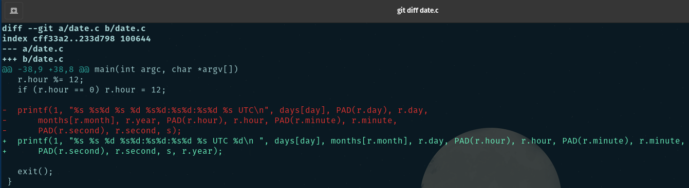

### proc.c
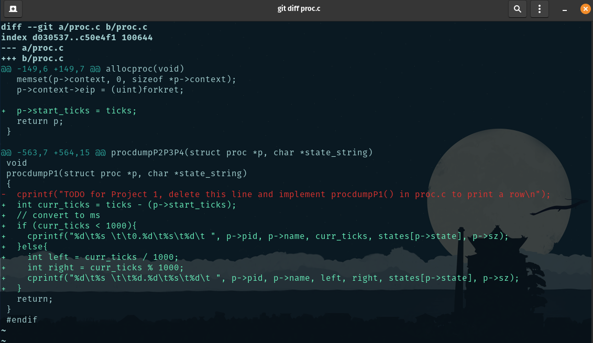

### proc.h
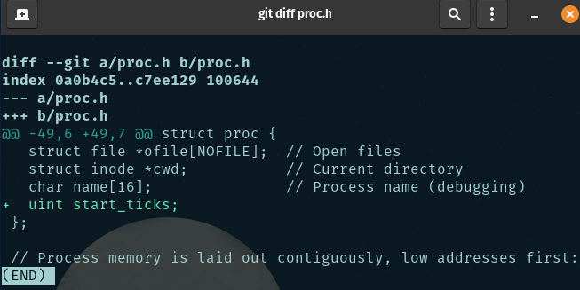

### syscall.c
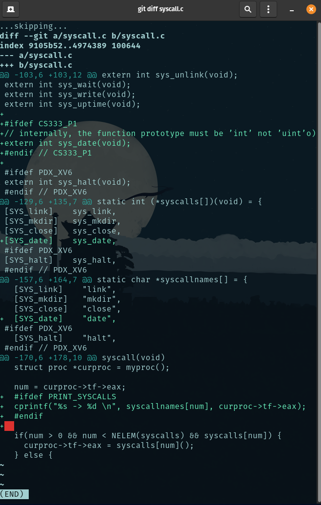

### syscall.h
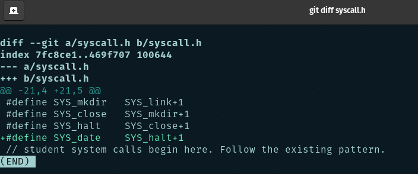

### sysproc.c
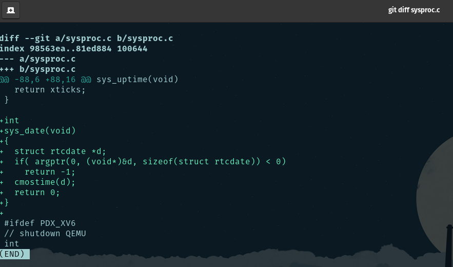

### user.h
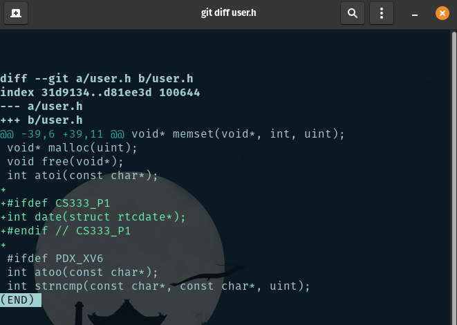

### usys.S
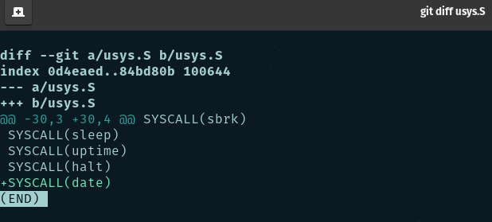
