# Running Test

### testsetuid

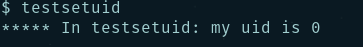

### testuidgid

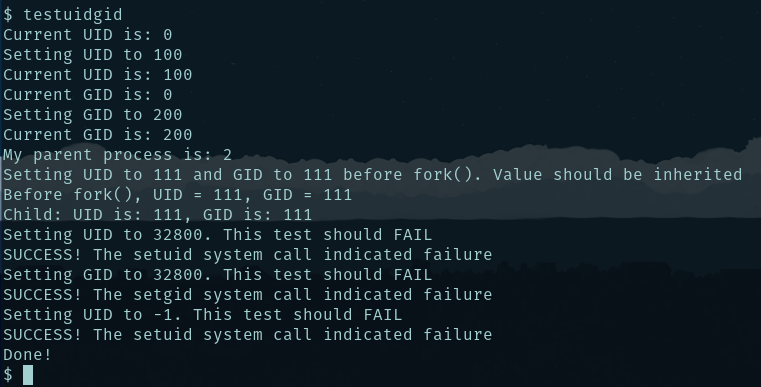

### p2-test

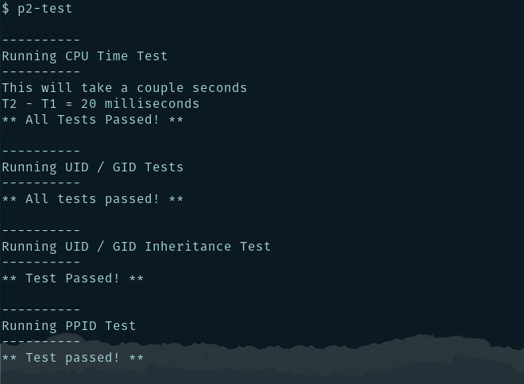
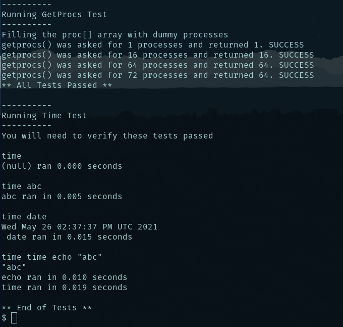

### ps

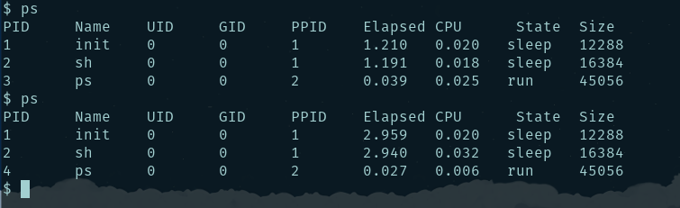

### Ctrl+p

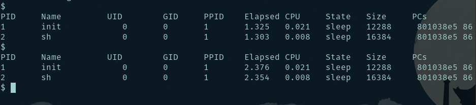

# Modified Code

### Makefile

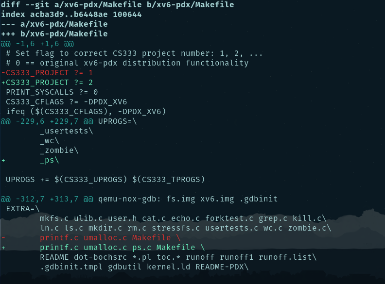

### defs.h

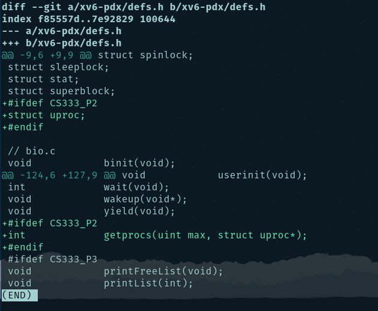

### proc.c

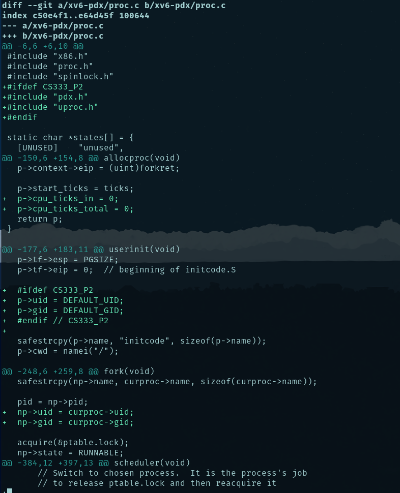
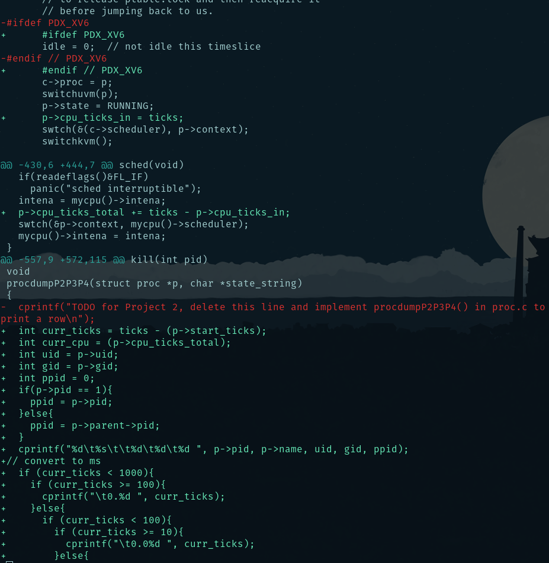
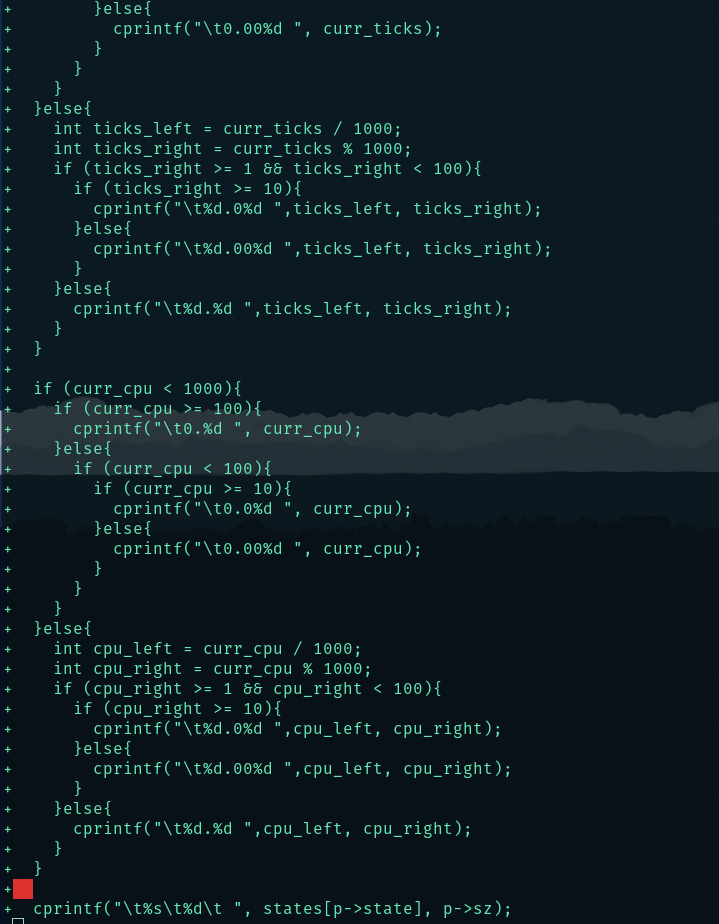
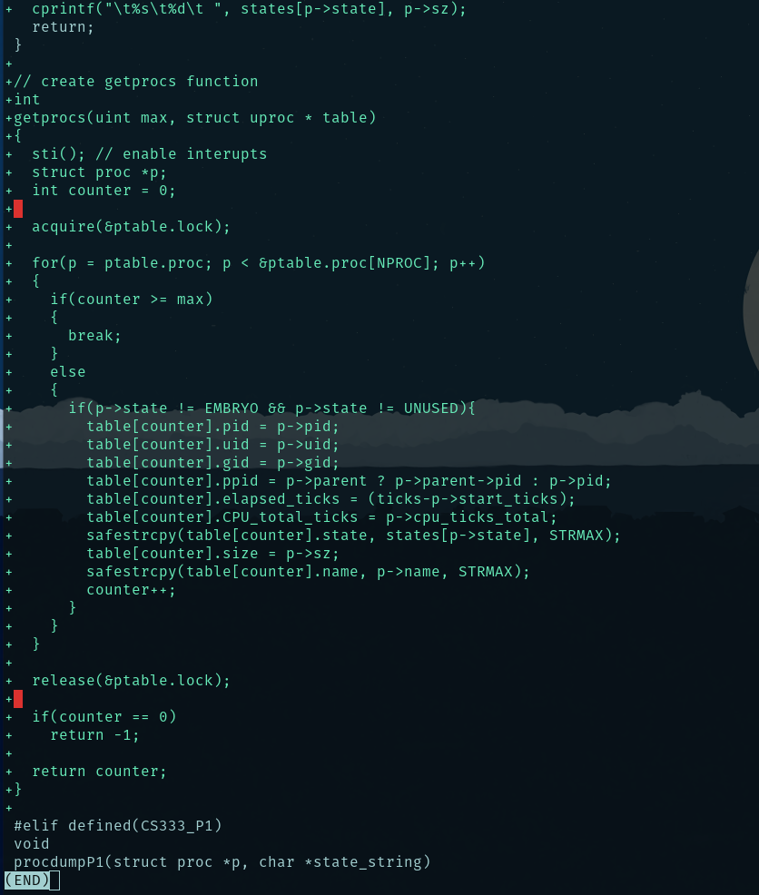

### proc.h

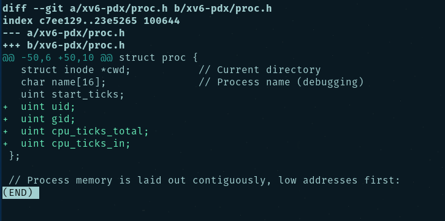

### syscall.c

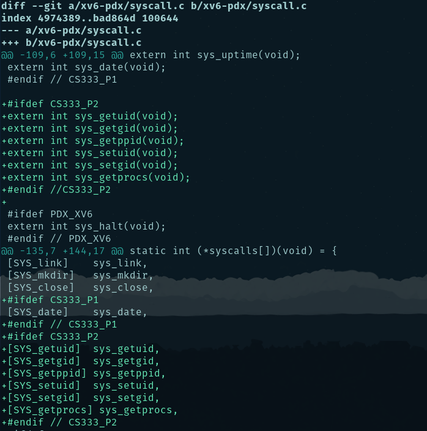
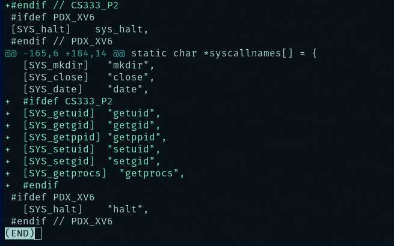

### syscall.h

### sysproc.c

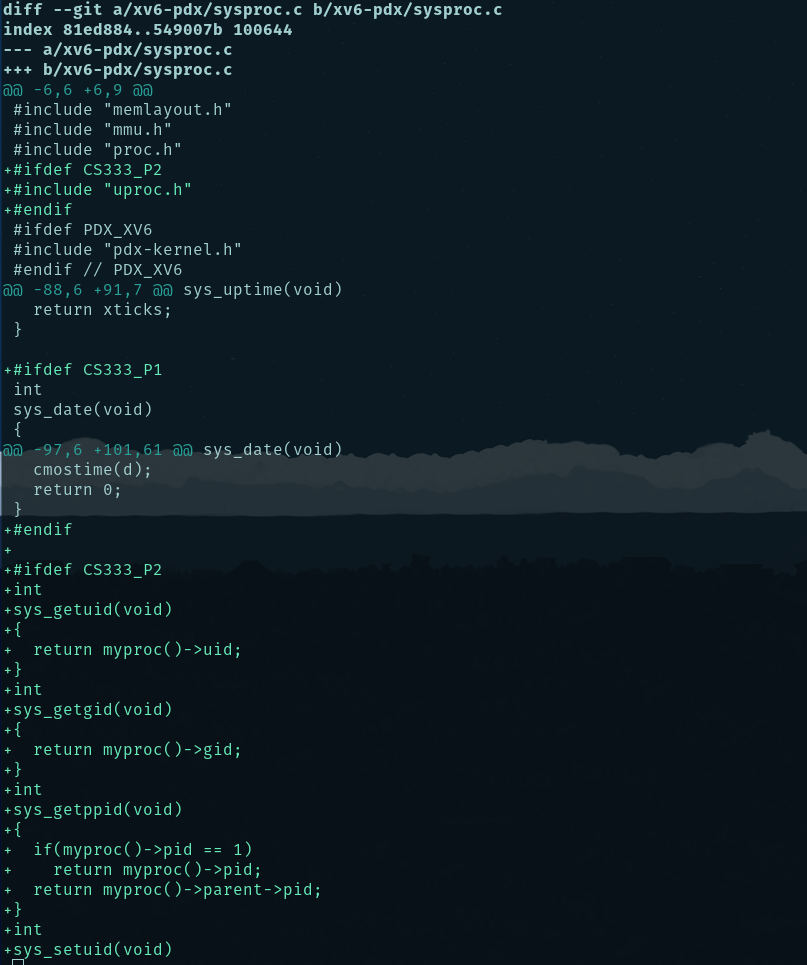
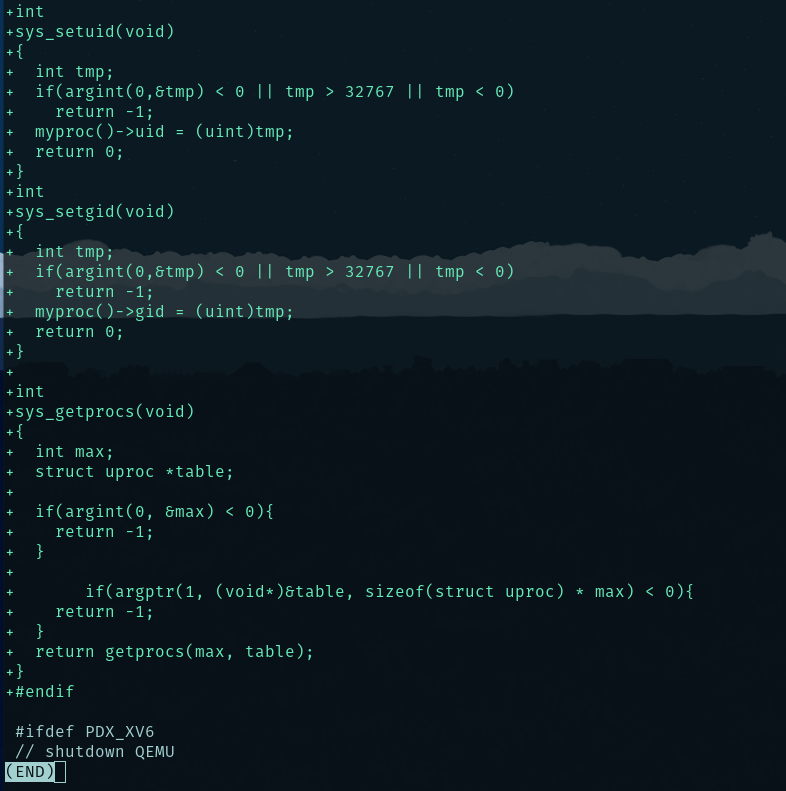

### user.h

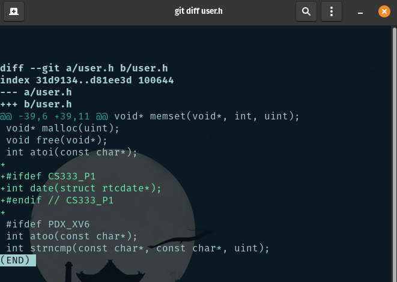

### usys.S

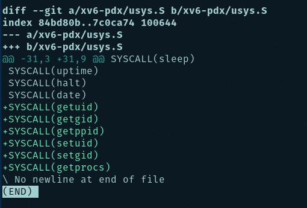

# Added 3 new files

### ps.c

### testsetuid.c

### time.c
