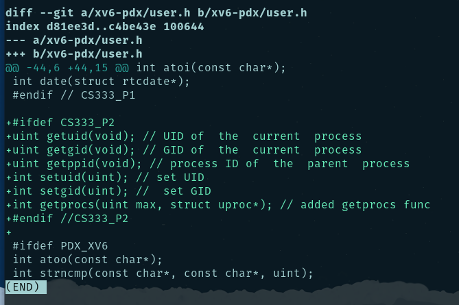

# Running Test

### testsetuid

### testuidgid

### p2-test

### ps

### Ctrl+p

# Modified Code

### Makefile

### defs.h

### proc.c

### proc.h

### syscall.c

### syscall.h

### sysproc.c

### user.h

### usys.S

# Added 3 new files

### ps.c

### testsetuid.c

### time.c
