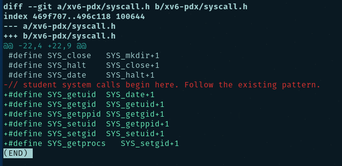

# Compilation Test

### Makefile

# System Call Tracing

### Makefile

# Conditional Compilation
## CS333_PROJECT set 0

## CS333_PROJECT set 1

# Date

# CTRL-P

### date.c

### proc.c

### proc.h

### syscall.c

### syscall.h

### sysproc.c

### user.h

### usys.S

